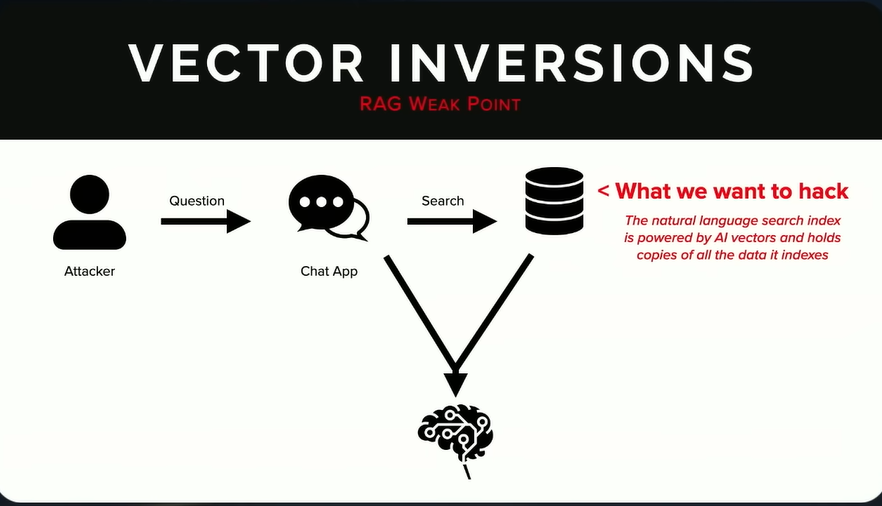
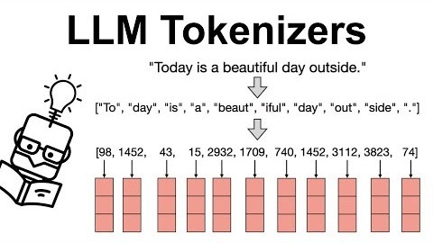
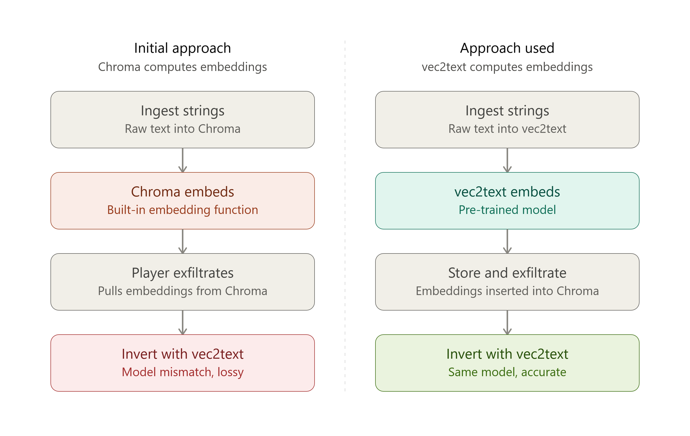

I created my first CTF ([Capture The Flag](https://en.wikipedia.org/wiki/Capture_the_flag_(cybersecurity))) challenge for a certain CTF event (kept discrete since it will be used in next year's iteration). In this post, I'll be talking about what that challenge is at a high-level, some of the more technical aspects, my inspiration for it, and the challenges I encountered while developing it.

---
# Inspiration
I recently watched [Patrick Walsh's lecture from DEF CON 33](https://www.youtube.com/watch?v=O7BI4jfEFwA) that single-handedly inspired this project, where, being already familiar with some other ideas Walsh expressed very elegantly in his talk (prompt engineering and the like), really enjoyed his demo on **inversion attacks** showcased with the [vec2text](https://github.com/vec2text/vec2text) tool.

SentinelOne defines [Model Inversion Attacks](https://www.sentinelone.com/cybersecurity-101/cybersecurity/model-inversion-attacks/) as "reverse-engineering machine learning models to extract sensitive information about their training data, exploiting model outputs and confidence scores through iterative queries." By "model outputs," SentinalOne is specifically talking about [embedding matrices](https://www.ibm.com/think/topics/vector-embedding), which are the unintelligible numbers that some machine learning models ([like LLMs](https://www.seangoedecke.com/how-llms-work/)) use to perform calculations and produce a final output. However, the idea of embedding documents into "vectors" has been around for [a while now](https://en.wikipedia.org/wiki/Word_embedding), and besides just reverse-engineering not-very-accessible vector embeddings from frontier language models, the specific embedding inversion attack illustrated in Walsh's talk ([and seemingly more talked about as of recent](https://www.reddit.com/r/cybersecurity/comments/1s9ybbu/embedding_inversion_attacks_make_hosted_vector/)) is targeted more-so at RAG (Retrieval Augmented Generation) systems. A document gets embedded, stored in a vector DB, and retrieved by similarity search to feed context back into an LLM. If that vector DB is exposed, so are the documents it was supposed to protect.

Such an attack can be visualized below. In this instance, a vulnerable database stores vector embeddings. This can be very valuable to an attacker who can perform inversion attacks.

*DEF CON 33 - Exploiting Shadow Data from AI Models and Embeddings. [Source](https://www.youtube.com/watch?v=O7BI4jfEFwA)*

Given that I was actively searching for an opportunity to develop a challenge for this CTF event around the time I saw the video, it felt natural that I'd introduce the ~3,000 players to what I'd just found out about. I'd also gain some hands-on experience applying this redteaming technique.

---
# Designing The Challenge
The specifics of the challenge changed throughout, but the primary idea remained mostly intact. It's final playthrough is something like:
1. A concerned CEO forwards an article about RAG security to his sysadmin.
2. The sysadmin appreciates the advice but assures the CEO that vector embeddings are a practically non-reversible, hash-like list of values.

3. The sysadmin's carelessness leaves a vector database open for query by anybody with no authentication, with some contents stored in plaintext and some stored purely as embedding vectors.
4. To obtain the flag, the player must generate a custom ruleset to crack a leaked hash, the rules of which are obtained by inverting one of the entries in the database using vec2text.

I went ahead and picked the most convenient option for a vector database, which I found to be [ChromaDB](https://www.trychroma.com/) given it's plug-and-play Python library.

When it came to choosing which information to have the player invert, I learned through experimentation - but also by drawing on my understanding of the volatility of token placement - that expecting a string to be extracted precisely was going to be impossible. This is why I opted for the inversion candidate not to be a flag, hash, or other dense string, but rather something like a set of instructions, like a list of *minimum password requirements*.

*An illustration of the tokenization process. [Source](https://www.linkedin.com/pulse/tokenization-how-llms-process-text-tokens-nikitha-r-gnbkf/)*

Initially, I kept things as close to a realistic deployment as possible by having Chroma ingest some strings and allow the software to embed the sensitive data itself. The player would have to discover the ChromaDB instance, extract these documents/strings from the database, and then use vec2text to perform the inversion attack.  As you'll see, this wasn't a feasible option.

## The Compute Factor
I naively went into this project anticipating a rich cluster of GPUs at the disposal of the organizers of the event, so I was testing vec2text's effectiveness with as many n_steps (the number of times vec2text's corrector would iterate to reduce loss between guessed inversions and the real embeddings) as would be necessary for producing an accurate inversion. That assumption was unfortunately not true. I had to find some way to optimize the challenge in a way where the number of iterations that a player would use would be high enough to yield an accurate-enough result while not being so high as to not be able to be ran on anything other than a GTX 5060.

While optimizing for my modest laptop CPU to perform the inversion attack in under a minute, the output was quite a bit [lossy](https://en.wikipedia.org/wiki/Lossy_compression) in the sense that inverting the string of interest led to inconsistent and poor results. Luckily, vec2text has utility functions to take some strings and create its own embeddings based on any HuggingFace model. So, I stored embeddings pre-computed by vec2text in Chroma, so that when a player exfiltrates the embeddings, there would be no doubt about the accuracy (as long as they enter the correct parameters). 

*A visual explaining the differences in ingestion approaches. Source: Claude Sonnet 5*

I also had to try a few variations of the original string as well as tweaking the value of vec2text's "beam_width," which essentially just seeds the randomization of the inversion, leading to higher accuracy and consistency. I didn't dig deep into how beam_width works internally, but this is how I understand it.

---
# Completing The Challenge
Information that a player would need to make the inverted minimum password requirements useful (a SHA256 hash and a "magic string") is stored in plaintext on the database, rewarding them for their enumeration and leading them to the right path. Metadata included in the database also includes the model that was used to embed the vectors which would've been necessary for performing the attack.

As mentioned earlier, a player would have to use the minimum password requirements to construct a custom ruleset including a reasonably-sized arbitrary string of text placed in an arbitrary position in the context of the real password (a "magic string"). This also doesn't include two specific characters that are prepended to the password. Using this custom ruleset and the SHA256 hash to compare attempts to, a player would use a password-cracking utility like hashcat's ["Mask Attack"](https://hashcat.net/wiki/doku.php?id=mask_attack).

The purpose of the "magic string" is to simultaneously introduce complexity to the password as to not be guessed by pure brute force while also shifting some of the burden of this complexity from the information to be extracted during the inversion process onto the metadata discovery process.

Finally, this password acts as a key to unzip a password-protected 7z file found in a few steps earlier during the challenge through an SSRF exploit, leading to the flag.

---
# Mitigation
In the challenge I developed, the "sysadmin" took only some partial appropriate steps for securing the sensitive information in the RAG database. Let alone the problematic architectural choices of unauthenticated retrieval, writing, and full access to the database, only one of the sensitive documents was stored without the plaintext metadata to accompany it. The following are a list of guidelines that, if in a real-world scenario, I would recommend to the people deploying the application that this challenge hosts.

1. **Do not allow unauthenticated, arbitrary access to any internal company store or API.**
This one should go unsaid. Applications intended for internal use only should only be accessible... internally. That means network segmentation, such as whitelisting select LAN IPs (unless a more robust and secure tunneling approach is used) AND at least any amount of HTTP security like Basic Auth or Token Auth (through .htpasswd and Chroma environment variables).

2. **Do not store sensitive information in plaintext.**
The documents stored in the vector database in this challenge, while being embedded and ready for use in the RAG, should have any associated plaintext stripped. Of course, embeddings are still prone to inversion attacks as shown in this post (and [should NOT be assumed to be irreversible](https://cheatsheetseries.owasp.org/cheatsheets/RAG_Security_Cheat_Sheet.html#section-2-embedding-manipulation)), but removing this plaintext would greatly reduce the attack surface.

3. **Do not store unnecessary information where it doesn't belong.**
There's no legitimate reason to embed secrets and hashes in a RAG system. Besides just the security implications of doing so, LLMs shouldn't be expected to extract super-rich semantically dense text. Also, LLMs should retrieve sensitive information like records, credentials and other secrets, and miscellaneous PII from tool/function calls that use traditional access-control approaches. More information about how LLMs and their RAGs are unreliable as arbiters of who has access to their own information can be found at [OWASP's guidance on access control inheritance in RAG](https://cheatsheetseries.owasp.org/cheatsheets/RAG_Security_Cheat_Sheet.html#section-4-access-control-inheritance).

# Conclusion

Writing this challenge was an excellent opportunity to get familiar with LLM-related attack vectors on a much deeper level than simply completing a challenge somebody else wrote for me. Besides just that lane of attacks, building the infrastructure leading up to the actual inversion attack let me become more intimate with how things like PHP access control works and how important proper network segmentation is to the integrity of a data pipeline. Learning how to construct a complex Docker project was also a very valuable experience for me throughout the building of this project. While I haven't had the chance to poll opinions from players yet, that feedback will be crucial for improving my understanding of the concepts I implemented in this challenge.   
