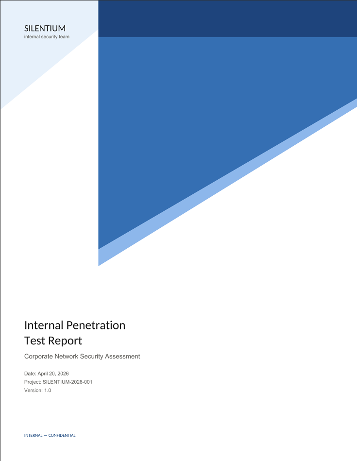
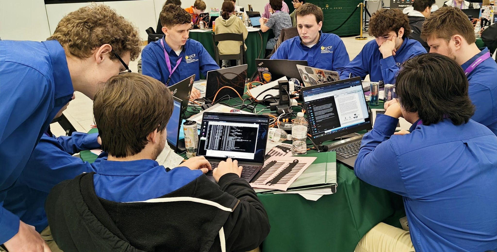
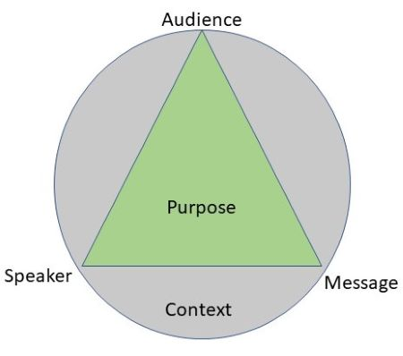
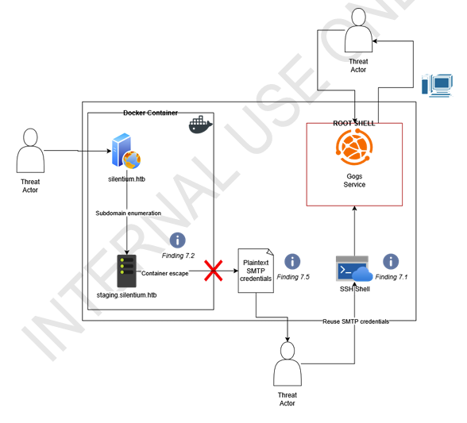
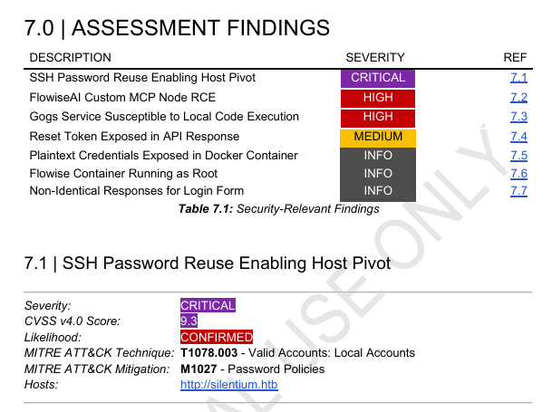
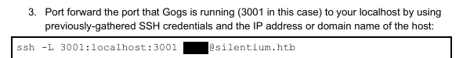
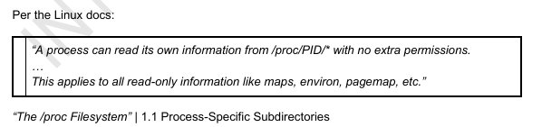

A few months ago, my friend and I were inspired by some other peers to take our redteaming HackTheBox exercises a step further: writing a full mock penetration test report.*The cover page generated for us by Claude Sonnet 5*.

They themselves were moved by what our school's award winning C3 team does twice per year in their [CPTC competitions](https://cp.tc/).

*UCF C3 team earlier this year during the NCCDC competition.*

During the course of 24 hours, a team of no more than 10 people participate in a hackathon-like competition to probe, poke at, and, finally, document vulnerabilities of a multi-machine network that culminates in a typically ~100-page report that simulates a real-world penetration test.

Myself and my friend, [Stephen](https://www.linkedin.com/in/stephenmiller05/), set out to take any HackTheBox machine and do the same thing. In the process, we learned a lot!

## Hacking the Box
If you're not already aware, [HackTheBox](https://www.hackthebox.com) is a free platform that allows users to break into intentionally vulnerable machines and "capture the flag" that awaits for the user upon successful exploitation. My friends and I use this website a ton to practice our redteaming skills (we even keep a scoreboard on the UCF Discord server).

[Silentium](https://www.hackthebox.com/machines/silentium) is an easy-rated, CVE-heavy HackTheBox machine that allowed us to focus mostly on the technical writing aspect of this challenge and less of the redteaming part. In the future, I'd like to make more mock reports on machines offered by HackTheBox that allow me to go into more detail on specific processes for exploiting the system rather than the technical details (sometimes a bit over our head) offered by the exploit we stumbled across while enumerating the machine for vulnerabilities.

## Gathering Inspiration
The first thing we had to ask before going in and writing was: "what does a real, official pentest report look like?" Luckily, we didn't have to wonder. There are plenty of resources out in the wild that offered us a glimpse into how pentest reports are structured - textually and visually. So, we spent a lot of time perusing [this repository](https://github.com/reconmap/pentest-reports/) and compiling visual elements throughout the writing process that we found cool. More importantly, it gave us some insight into the appropriate length of certain sections, where figures should be inserted, and small things like tone selection.

## Writing
It just so happens that the semester in college that we wrote this report was the semester that I was taking a professional writing class, which not only meant that my writing muscles had been worked recently, but also that I understood a key part of writing professional reports. What I had in mind was to balance the report in a "PAM" triangle, meaning not just prioritizing the Purpose of the report, but also the Message and how it's conveyed, and the Audience it's written for. This appears to be an adaptation of Aristotle's Rhetorical Triangle.

*One variation of the Rhetorical Triangle.*

Essentially it just reminded us that for the purposes of this "assignment", we'd be writing so that the report can be understood across a wide spectrum of C-suites, senior-level technicians, and lower-level vulnerability researchers and security engineers. After all, the people at a company that approve a large sum of money to be used for commissioning a pentest report want to understand the value that they received from such an investment. Likewise, the details of a successful exploitation by the pentesters is a useful vector for anybody at the company that works to secure their digital infrastructure.

To cover each of the roles we were catering to, each section existed for a purpose. For instance, plenty of summaries existed before the meat of the report (findings and their CVSS scores). This provided an introduction to the specifics of the engagement to ground not only potentially tech-unsavvy individuals but also their engineers. Even in the individual finding reports, impact summaries are provided to help an employee understand the scope of a particular issue.

Providing engineers with clear reproduction steps will go a long way in helping them quickly identify where the issue exists and remediating it, with or without our suggestions.

Equally (and arguably more) effective for communicating some of these ideas at a high-level are visuals.

## Visuals
One important aspect of writing an effective report is conveying things visually, like the layout of the network. Below, I documented the attack chain that a threat actor could take to gain root access on the host system, incorporating the network architecture into said path.
*A visual that I created with draw.io*

We also wanted to highlight the most important vulnerabilities that we found in the stack before any others. So, the assessment findings are sorted from highest to least severity and color-coded accordingly. Further, in a heavily-inspired way from a "Vuln Table" I had seen in the repository mentioned earlier, we kept things brief and "compressed". Also, hyperlinks!
*Assessment findings in the report followed by our vulnerability summary table*

Code blocks are presented inside of a 1x1 table in monospace font; censor sensitive information:

Quote blocks are not the same as code blocks:

## Conclusion
I gained valuable soft skills throughout this exercise like designing visuals, working with word editors, and conveying complex ideas to a wide range of people. It also tested my understanding of the very engagement that my friend and I spent no longer than a day on (plus one more in the beginning of the CTF). I hope to produce more like this in the future!